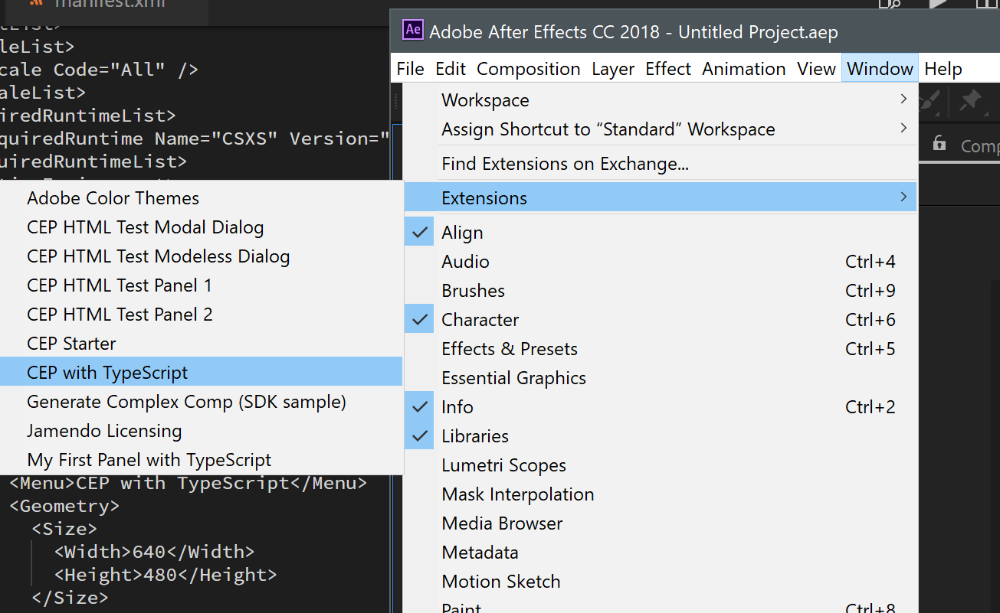
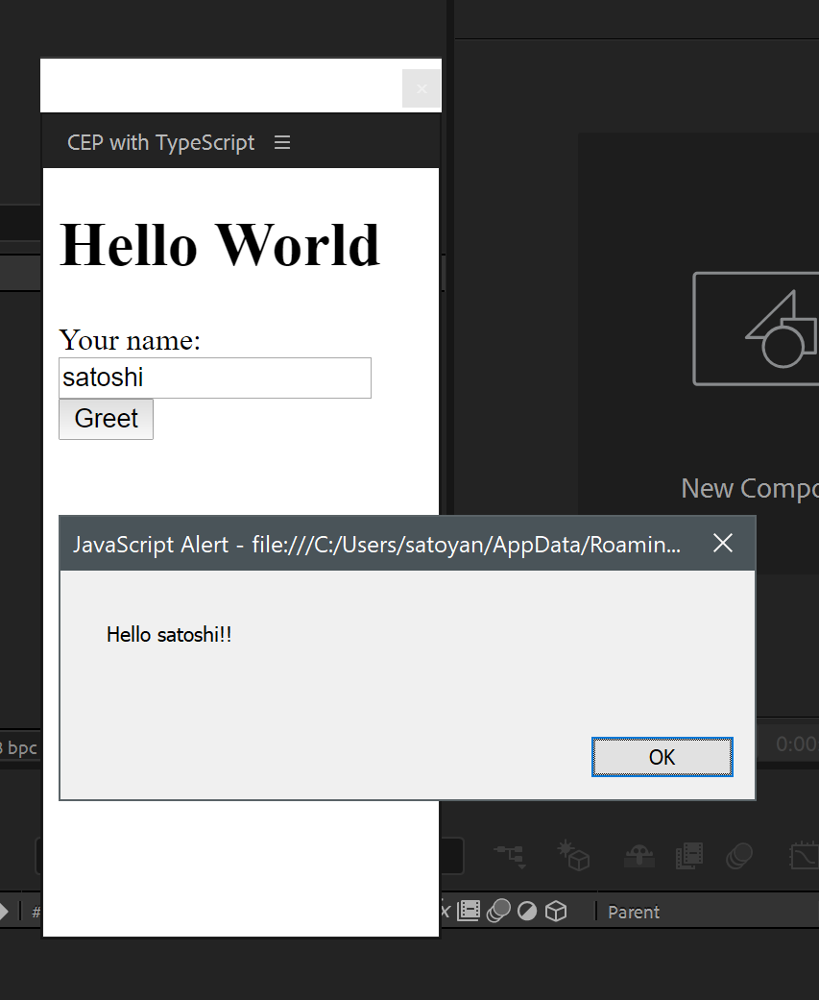
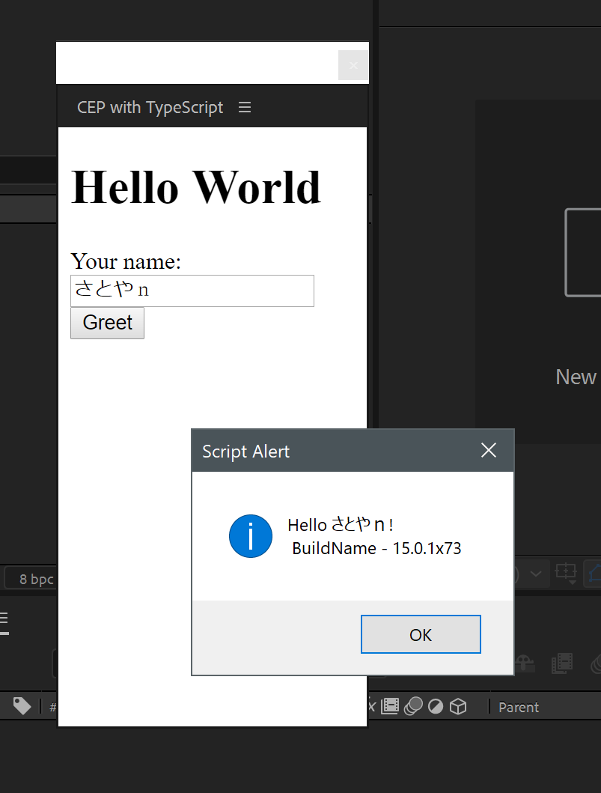
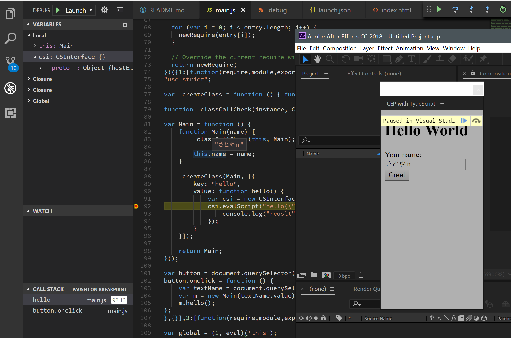

AdobeのCEPと呼ばれる技術を使ってAdobe製品の拡張機能を作る機会ができたので、これらをTypeScriptで書くための方法をまとめの意味も含めて記します。
環境はWindows10で行っていますが、基本的にコマンド操作はWSLを前提としているため、OSXでもパス関係以外は大きな違いはないと思います。

## 環境
* OS: Windows10 and WSL
* Editor: VSCode
* NodeJS: >= 8.9
* AfterEffects2018

## やること
* クライアントだけでHello World
* クライアントからホスト側のHello World
* VSCodeでデバッグ

## ディレクトリ構造
```
.
├── client
│   ├── dist
│   ├── lib
│   └── src
├── CSXS
└── host
    ├── dist
    └── src
```

### 署名なしでAdobe CEP拡張機能を使えるようにする

CEP拡張機能はセキュリティ上の問題から署名が求められます。ただローカルで動かすだけなら以下の方法で署名を回避することができます。詳細については下記のリンク先を参照してください。

https://github.com/Adobe-CEP/CEP-Resources/blob/master/CEP_8.x/Documentation/CEP%208.0%20HTML%20Extension%20Cookbook.md#debugging-unsigned-extensions

* Windowsの場合はレジストリをいじります。

    regedit > HKEY_CURRENT_USER/Software/Adobe/CSXS.8, then add a new entry PlayerDebugMode of type "string" with the value of "1".
* OSXの場合は上記URLを参照してみてください

### 所定フォルダへシンボリックリンクを貼る
https://github.com/Adobe-CEP/CEP-Resources/blob/master/CEP_8.x/Documentation/CEP%208.0%20HTML%20Extension%20Cookbook.md#extension-folders

作成したエクステンションをAdobe製品のメニューに表示させるには、3通り方法があるようです。詳細は上記リンクを参照してください。
一番手っ取り早いのはユーザー単位のディレクトリに置くことではないかと思います。
* Win: C:\Users\<USERNAME>\AppData\Roaming\Adobe\CEP/extensions
* Mac: ~/Library/Application Support/Adobe/CEP/extensions

直接これらのフォルダで開発しても問題はないのですが、普通はあまりしたくないと思います。
OSXであればシンボリックリンクを簡単に作れるのですが、Windowsだとできるのは知っていますが、コマンドも作法もなんかよくわかりませんし、sudoもないためPowershellを管理者権限で起動するとかしないといけません。
で、調べていたら、[Link Shell Extension](http://schinagl.priv.at/nt/hardlinkshellext/hardlinkshellext.html)と言うものがあることがわかり、それを使うことにしました。これだとファイルエクスプローラー上で右クリックで簡単にWindowsでもシンボリックリンクを作成できるのでおすすめです。

シンボリックリンクはこんな感じのパスになります。
```
C:\Users\Your User Name\AppData\Roaming\Adobe\CEP\extensions\Your CEP
```

別にどこのディレクトリで開発しようと気にならないよ、ということであればわざわざシンボリックリンクをはることはありません。直接Adobe指定のディレクトリでOKです。

## クライアント - Hello Word
最初にクライアント側のページとスクリプトをTypeScriptで作ります。
```
$ cd client
$ npm init -y
$ npm i -D typescript parcel-bundler
```

バンドルにはWebpackではなくParcelを使うことにしました。Webpackの設定ファイル毎回書くたびに忘れてるのでParcelは本当に助かります。

### TypeScript設定
```
$ ./node_modules/.bin/tsc --init
```

tsconfig.json こんな感じでしょうか。
```javascript:client/tsconfig.json
{
  "compilerOptions": {
    "target": "es2015", /* Specify ECMAScript target version: 'ES3' (default), 'ES5', 'ES2015', 'ES2016', 'ES2017','ES2018' or 'ESNEXT'. */
    "module": "es2015", /* Specify module code generation: 'none', 'commonjs', 'amd', 'system', 'umd', 'es2015', or 'ESNext'. */
    "allowJs": true, /* Allow javascript files to be compiled. */
    "strict": true, /* Enable all strict type-checking options. */
    "moduleResolution": "node", /* Specify module resolution strategy: 'node' (Node.js) or 'classic' (TypeScript pre-1.6). */
    "esModuleInterop": true /* Enables emit interoperability between CommonJS and ES Modules via creation of namespace objects for all imports. Implies 'allowSyntheticDefaultImports'. */
  }
}
```

### index.html
index.htmlを書きます。
ボタンをクリックするとテキストボックに入力した文字列と組み合わせてHello xxxxと表示させるシンプルなものです。

```html:client/index.html
<!DOCTYPE html>
<html>

<head>
    <title>CEP with TypeScript</title>
</head>

<body>
    <h1>Hello World</h1>
    <div>
        Your name:
        <input type="text" id="textName">
        <button id="buttonGreet">Greet</button>
    </div>

    <script src="./dist/main.js"></script>
</body>

</html>
```

bodyタグ最終行のscriptタグにはコンパイル済みのjsファイルを指定しています。
本来parcelではエントリポイントをindex.htmlにすれば直接TypeScriptファイル、この場合は __src/main.ts__ と書くとバンドル時にこのパスを書き換えてくれますが、その際に絶対パスに書き換えてしまうため、CEPとして動かす際に問題が起こります。なのでこのサンプルではindex.htmlはバンドル対象にしていません。

### main.ts
TypeScriptファイルはこんな感じです。特に説明は不要かと思います。

```typescript:client/src/
class Main {
    constructor(public name: string) {
    }

    hello() {
        alert(`Hello ${this.name}!!`);
    }
}

const button = document.querySelector('#buttonGreet') as HTMLButtonElement;
button.onclick = () => {
    const textName = document.querySelector('#textName') as HTMLInputElement;
    const m = new Main(textName.value);
    m.hello();
}
```

### バンドル
parcelを使ってソースのコンパイル～バンドルを実行します。
```
$ ./node_modules/.bin/parcel --hmr-hostname=localhot src/main.ts
```

上記を実行するとsrc/main.tsをエントリポイントとして関連するファイルがあればそれらをすべてコンパイル～バンドルしてくれます。

client/dist ディレクトリにmain.js ファイルが出力されているかと思います。

また、parcelは同時にWebサーバーを起動してコンテンツのホスティングおよびHMR（ホットモジュールリプレースメント）の仕組みを提供してくれます。

ポートはhttpが1234で、HMRのためのWebSocketはランダムなものが使用されているようです。

今回はエントリポイントがindex.htmlではなくTypeScriptファイルなので、http://localhost:1234 にアクセスしても何も表示されないと思います。parcel watchでバンドルすればWebサーバーは起動しないのですが、それだとHMRも使えなくなります。実際にCEPパネルとして開発する際にソースをいじる度にAdobe製品のメニューからCEPパネルを呼び出すのは面倒なので、HMRは半ば必須な機能かと思われます。

--hmr-hostname オプションを忘れないで下さい。少なくともParcelの1.6ではCEPで動かす場合はこれがないとWebsocketの接続確立時にコケます。気になる方は生成されるJSソースを覗いてみてください。

## manifest.xmlの準備
クライアントのファイルは準備できました。
次はCEPパネルとして登録するためのXMLファイルを用意します。
ファイルは、CSXS/manifest.xmlに置く必要があります。CSXSディレクトリは大文字である必要があります。

ファイルはこんな感じです。

```xml:CSXS/manifest.xml
<?xml version='1.0' encoding='UTF-8'?>
<ExtensionManifest ExtensionBundleId="test.mycep"
  ExtensionBundleVersion="1.0.0" Version="6.0" xmlns:xsi="http://www.w3.org/2001/XMLSchema-instance">
  <ExtensionList>
    <Extension Id="test.mycep.panel" Version="1.0.0" />
  </ExtensionList>
  <ExecutionEnvironment>
    <HostList>
      <Host Name="AEFT" Version="15.0" />
    </HostList>
    <LocaleList>
      <Locale Code="All" />
    </LocaleList>
    <RequiredRuntimeList>
      <RequiredRuntime Name="CSXS" Version="6.0" />
    </RequiredRuntimeList>
  </ExecutionEnvironment>
  <DispatchInfoList>
    <Extension Id="test.mycep.panel">
      <DispatchInfo>
        <Resources>
          <MainPath>./client/index.html</MainPath>
          <CEFCommandLine />
        </Resources>
        <Lifecycle>
          <AutoVisible>true</AutoVisible>
        </Lifecycle>
        <UI>
          <Type>Panel</Type>

          <!-- ここで定義した文字列がメニューに表示されます -->
          <Menu>CEP with TypeScript</Menu>
          <Geometry>
            <Size>
              <Width>640</Width>
              <Height>480</Height>
            </Size>
          </Geometry>
          <Icons />
        </UI>
      </DispatchInfo>
    </Extension>
  </DispatchInfoList>
</ExtensionManifest>

```
@ExtensionBundleId、Extension@Id、Host@Name は適宜変更してください。

MainPathタグにHTMLコンテツファイルを設定します。MenuやSizeタグは多分なんとなく分かるかと思うので説明は省きます。

manifest.xml詳細については、[こちら](https://github.com/Adobe-CEP/CEP-Resources/blob/master/CEP_8.x/Documentation/CEP%208.0%20HTML%20Extension%20Cookbook.md#extension-manifest) を参照してください。

## デバッグファイルの準備
AfterEffectsから実行する前にデバッグ用のファイルを準備します。これがあるとChromeでのリモートでバッグ可能になります。動かすために必須のものではありませんが、実際に開発する上ではあったほうがいいと思います。

プロジェクトルートに.debugというファイル名で次のようなファイルを用意します。

```xml:.debug
<?xml version="1.0" encoding="UTF-8"?>
<ExtensionList>
    <!-- Id属性はデバッグ対象のCEPエクステンションと同じIDを指定します -->
    <Extension Id="test.mycep.panel">
        <HostList>
            <!-- ポート番号は任意の値でOKです -->
            <Host Name="AEFT" Port="9000"/>
        </HostList>
    </Extension>
</ExtensionList>
```

Extension@Idは先程のmanifest.xmlで設定したものと同じものを設定します。
Port番号は9000にしていますが、他とかぶらなければ好きな値で構いません。

詳細は[こちら](https://github.com/Adobe-CEP/CEP-Resources/blob/master/CEP_8.x/Documentation/CEP%208.0%20HTML%20Extension%20Cookbook.md#remote-debugging)を参照してください。

## AfterEffectsから実行
これで最低限の準備はできたので、実際にAfterEffectsから呼び出してみたいと思います。
所定の場所にファイルがあることを確認してください。
Windowsの場合は: C:\Users\<USERNAME>\AppData\Roaming\Adobe\CEP\extensions\このフォルダ になります。

こんな感じで __CEP with TypeScript__ メニューが表示されているかと思います。



ちゃんと動いたでしょうか？


main.tsファイルが変更されると自動的にコンパイルされてパネルのスクリプトもリロードされます。試してみてください。
もちろんparcelを止めていたら動きません、、、、。

index.htmlを修正する場合はパネルを閉じて再度呼び出さないと反映されません。実際にはReactやVueなどで開発するかと思うので気にはならないと思います。

## Host - Hello World

次はホスト側（ExtendScript）でHello Worldコードを書いてみようと思います。
具体的には、ホスト側のコンテクストでアラートでHello Worldを表示するメソッドを作って、それをクライアントから呼び出す、というものになります。

最初にクライアント同様、TypeScript、npmの初期設定をします。
```
# hostディレクトリに移動
$ cd プロジェクトルート/host
$ npm init -y
$ npm i -D typescript parcel-bundler
$ ./node_modules/.bin/tsc --init
```

### package.json
追加で必要なnpmライブラリをpacakge.jsonに追加します。
devDependenciesを下記のように設定します。

```javascript:./host/package.json
  "devDependencies": {
    "parcel-bundler": "^1.6.2",
    "typescript": "^2.7.2",
    "types-for-adobe": "github:pravdomil/types-for-adobe",
    "extendscript-es5-shim-ts": "~0.0.1"
  }
```
* types-for-adobe - ExtendScriptの型定義ファイル一式
* extendscript-es5-shim-ts - ExtendScriptでES5レベルを実現するライブラリ

### tsconfig.json
続いてTypeScriptの設定ファイルを変更します。クライアント側と違ってExtendScriptという特殊な環境で動かすため若干異なります。
こんな感じです。
```javascript:./host/tsconfig.json
{
  "compilerOptions": {
    "target": "es3",                          /* Specify ECMAScript target version: 'ES3' (default), 'ES5', 'ES2015', 'ES2016', 'ES2017','ES2018' or 'ESNEXT'. */
    "module": "commonjs",                     /* Specify module code generation: 'none', 'commonjs', 'amd', 'system', 'umd', 'es2015', or 'ESNext'. */
    "noLib": true,
    "strict": false,                           /* Enable all strict type-checking options. */
    "esModuleInterop": true                   /* Enables emit interoperability between CommonJS and ES Modules via creation of namespace objects for all imports. Implies 'allowSyntheticDefaultImports'. */
  }
}
```

target, noLibがちょっと通常のHTMLアプリを書くときとは異なります。ExtendScriptは残念ながらES3レベルなのと、Adobe製品を操作するための独自のランタイムライブラリを提供するため__noLib__をfalseにする必要があります。

### main.ts
Hello Worldコードを書いてみます。こんな感じでしょうか。
```TypeScript:./host/src/main.ts
/// <reference types="types-for-adobe/AfterEffects/2018" />

class Main {
    static hello(name: string) {
        const message = `Hello ${name}!\r\n BuildName - ${app.buildName}`;

        alert(message);
    }
}

// クライアントから呼び出せるようにするグローバルな関数を定義
$.global.hello = Main.hello;
```

わざわざクラスとかにする必要はありませんがTypeScriptで書けるということを強調してみました。
クライアントから呼び出し可能にするにはグローバルにアクセスできるようにする必要があります。最後の行がそれになります。

これをクライアント同様にparcelでコンパイル～バンドルします。

```
$ ./node_modules/.bin/parcel watch --no-hmr src/main.ts
```

幾つかオプションを付けています。詳細はヘルプコマンドを見るか公式サイトのドキュメントを参照してください。

* watch - Webサーバーを立てる必要はない場合はwatchコマンドでやればいいようです。
* --no-hmr - バンドル時にHMRのコードを埋め込みません。

watchコマンドに関してはポートがかぶらなければWebサーバーを起動しても問題ないとは思いますが意味が無いので立てないようにしています。__no-hmr__ オプションの方はこれを指定することでHMRのコードがバンドルされないようになります。HMRはWebSockeを利用してモジュールの入れ替えを実現していますがExtendScriptのランタイムにはWebSocketなんてありませんのでこのオプションを指定しないと実行時に必ずエラーになります。

### クライントから呼び出す
#### CSIinterface.jsを導入
クライアントからホストのスクリプトを呼び出すには、Adobeが提供するJSライブラリが必要になります。
[Github](https://github.com/Adobe-CEP/CEP-Resources/tree/master/CEP_8.x)で公開しているので、そこからCSInterface.jsというファイルをlibというディレクトリを作ってそこにおいてみました。念のため今現在のclientディレクトリの構造はこんな感じになっています。
```
.
├── client
│   ├── dist
│   ├── index.html
│   ├── lib <--ここにCSInterface.jsを置きます
│   ├── node_modules
│   ├── package.json
│   ├── package-lock.json
│   ├── src
│   └── tsconfig.json
```

CSInterface.jsをコピーしたらindex.htmlでそれを読み込むように修正します。
```html:./client/index.html
<body>
    <h1>Hello World</h1>
    <div>
        Your name:
        <input type="text" id="textName">
        <button id="buttonGreet">Greet</button>
    </div>

    <script src="./lib/CSInterface.js"></script> <!-- この行を追加 -->
    <script src="./dist/main.js"></script>
</body>
```

続いてTypeScriptファイルをこんな感じに修正してみます。
Main#helloメソッドだけを変更しました。

```typescript:./client/src/main.ts
class Main {
    constructor(public name: string) {
    }

    hello() {
        // ここから
        const csi = new CSInterface();
        csi.evalScript(`hello("${this.name}")`, (result: string) => {
            console.log("reuslt", result);
        });
        // ここまで
    }
}

const button = document.querySelector('#buttonGreet') as HTMLButtonElement;
button.onclick = () => {
    const textName = document.querySelector('#textName') as HTMLInputElement;
    const m = new Main(textName.value);
    m.hello();
}
```

ホスト側のスクリプトを呼び出すにはいわゆるevalして呼び出すようです。あまりきれいな方法とは思えませんがそうするしか無いようです。

先程ホスト側で定義したhelloメソッドを引数を付けて呼び出しています。スクリプトを文字列表現しているため引数があるとちょっと見づらいです、、、。

これで再度AfterEffectsから実行してみます。こんな感じで実行できたかと思います。



## おしまい

だいたいこんな感じでCEP拡張パネルをTypeScriptで開発しています。
Github上でもAdobeがスターター的なものを提供していますが、なんかイマイチだったので自分で一からビルド環境を構築してみました。やり方は他にもありますが参考になれば幸いです。

## おまけ - VSCodeでデバッグ

VSCodeのlaunch.jsonをこんな感じにすると生成されたJSファイルでブレークポイントをおいたりデバッグができました。
残念ながらソースマップを使った方法はできませんでした（なんでだろう？）

```javascript:launch.json
{
    // Use IntelliSense to learn about possible attributes.
    // Hover to view descriptions of existing attributes.
    // For more information, visit: https://go.microsoft.com/fwlink/?linkid=830387
    "version": "0.2.0",
    "configurations": [
        {
            "type": "chrome",
            "request": "attach",
            "name": "Attach",
            "port": 9000,
            "webRoot": "${workspaceFolder}"
        }
    ]
}
```

